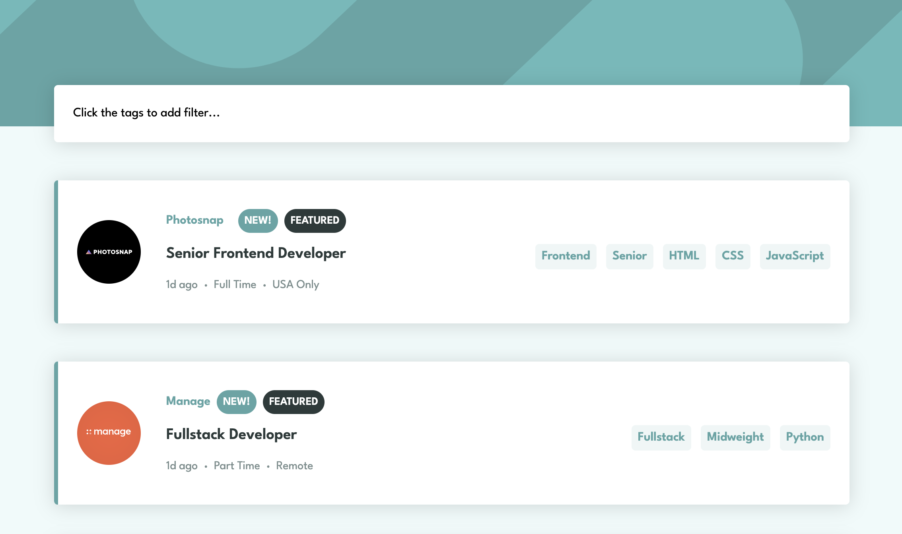

# Frontend Mentor - Job listings with filtering solution

This is a solution to the [Job listings with filtering challenge on Frontend Mentor](https://www.frontendmentor.io/challenges/job-listings-with-filtering-ivstIPCt). Frontend Mentor challenges help you improve your coding skills by building realistic projects.

## Table of contents

- [Overview](#overview)
  - [The challenge](#the-challenge)
  - [Screenshot](#screenshot)
  - [Links](#links)
- [My process](#my-process)
  - [Built with](#built-with)
  - [What I learned](#what-i-learned)
  - [Useful resources](#useful-resources)
- [Author](#author)

## Overview

### The challenge

Users should be able to:

- View the optimal layout for the site depending on their device's screen size
- See hover states for all interactive elements on the page
- Filter job listings based on the categories

### Screenshot

### Links

- Solution URL: [Solution](https://github.com/jaymiyam/frontend-mentor-job-listing)
- Live Site URL: [Live Site](https://jaymiyam.github.io/frontend-mentor-job-listing)

## My process

### Built with

- Semantic HTML5 markup
- CSS custom properties
- Vue 3 Composition API
- Pinia
- Mobile-first workflow

### What I learned

1. How to fetch local JSON files and use in Pinia.
2. How to use Pinia data in Vue files.
3. How to add transitions to v-for list items in Vue files.
4. How to filter an array with multiple filter parameters.

### Useful resources

- [Filtering, sorting and searching in arrays in Vue JS](https://medium.com/swlh/filtering-sorting-and-searching-in-arrays-with-vue-js-f60951c040fc) - This is a great article covering the basics of filtering, sorting and searching.

## Author

- Frontend Mentor - [@jaymiyam](https://www.frontendmentor.io/profile/jaymiyam)
